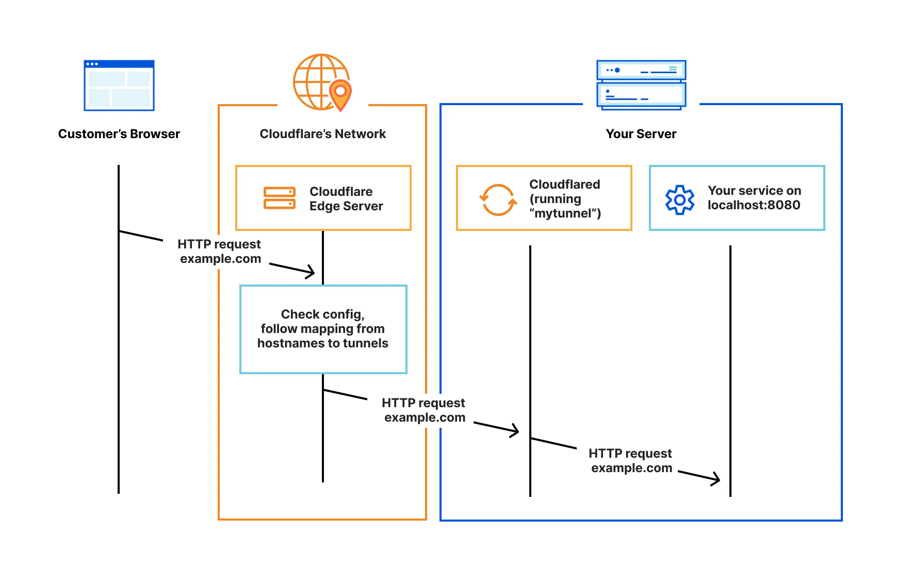
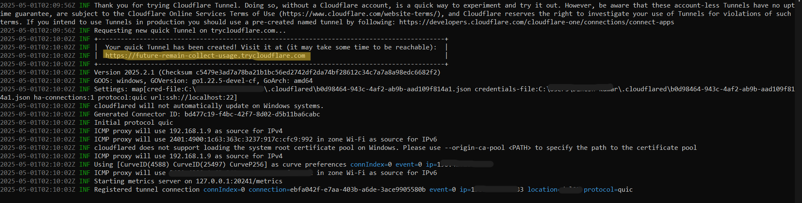

# Old Laptop → Home Server (Accessible via the Internet)

Turning your old laptop into a home server is a smart way to reuse aging hardware or build a local development environment—without dropping cash on fancy equipment or third-party services.

But here's the catch: setting this up usually involves  
1. Getting a **static IP**  
2. **Port forwarding** on your router

Both can be a pain. 
Getting a static IP can cost more than it's worth for a home setup. And port forwarding opens the door (literally) to some serious security risks.

### 🚀 The Good News?

You *don’t* need a static IP. You *don’t* need to mess with your router.  
This guide shows you how to turn your laptop into a secure, internet-accessible home server **without** all that hassle.

We’ll use:
- 🛡️ **Cloudflare Tunnel**
- 🔁 **Dynamic DNS (DDNS)**

These tools securely expose your server to the internet—*without* punching holes in your firewall.

---

### ☁️ How Cloudflare Tunnel Works



> `Cloudflare Tunnel` creates a secure, outbound-only connection from your local server to Cloudflare’s global edge network. It uses a lightweight client (`cloudflared`) that runs on your machine and tunnels traffic through Cloudflare, hiding your server’s real IP and reducing exposure to direct attacks. Multiple instances of `cloudflared` can run for load balancing and failover, ensuring fast and reliable routing to the nearest Cloudflare data center.

---

## 🛠️ Steps

1. ### [Enable SSH to Start on Boot](#enable-ssh-to-start-on-boot)  
   Set up SSH so it launches automatically when your system boots.  
   👉 [How to enable SSH on startup](#enable-ssh-to-start-on-boot)

2. ### [Run Cloudflare Tunnel on Startup](#run-cloudflare-tunnel-on-startup)  
   Configure the tunnel to auto-run on system startup. This ensures your server stays reachable online.
   - **[First-Time Tunnel Setup](#first-time-tunnel-setup)**
     - **[If You Have a Domain](#if-you-have-a-domain-name)** – Set it up with your domain name.
     - **[If You Don't Have a Domain](#if-you-dont-have-a-domain-name)** – No worries, it still works!

3. ### [Test and Verify the Setup](#test-and-verify-the-setup)  
   Once it’s all set up, test SSH access through the Cloudflare Tunnel. Make sure everything is running smoothly and securely.

---


### Section Details

## Enable SSH to Start on Boot
Here’s how you can make sure SSH starts automatically when your system reboots:

```bash
sudo systemctl enable ssh
```

### 🚧 First-Time Tunnel Setup

#### 🌐 If You Own a Domain Name

Instructions for setting up the tunnel with your domain name:

---

**1️⃣ Login to Cloudflare:**

```bash
cloudflared login
```

- Log in to your Cloudflare account and select your domain.
- Once verified, Cloudflare generates a certificate and saves it (usually in `~/.cloudflared/`).
- This allows your CLI to securely manage tunnels without needing to log in every time.

---

**2️⃣ Create a Tunnel:**

- Visit [Cloudflare Zero Trust Dashboard](https://one.dash.cloudflare.com/)
- Select **Create a tunnel**
- Choose **Cloudflared** as the connector type and click **Next**
- Name your tunnel and click **Save**

---

**3️⃣ Connect an Application (e.g., SSH):**

⚠️ **NOTE: ENSURE THE FOLLOWING HAVE BEEN DONE BEFORE PROCEEDING**
- ✅ [Add your website to Cloudflare](https://developers.cloudflare.com/fundamentals/setup/manage-domains/add-site/)
- ✅ [Update your domain's nameservers to Cloudflare](https://developers.cloudflare.com/dns/zone-setups/full-setup/setup/)

Then:

- In the **Public Hostnames** tab, click **Add a public hostname**
- Enter a **subdomain** and choose your **domain** from the dropdown
- Specify your service (e.g., `ssh://localhost:22`)

📝 **Note:** If you add a multi-level subdomain, you must order an **Advanced Certificate**

- Configure any additional parameters under **Additional application settings**
- Click **Save hostname**

---

#### 🔁 Run Cloudflare Tunnel on System Reboot

Set up a custom `systemd` service that starts the tunnel at boot.

Create the service file:

```bash
sudo nano /etc/systemd/system/<FILE_NAME>.service
```

Paste the following content (replace `<USERNAME>` with your actual Linux username):

```ini
[Unit]
Description=Cloudflare Tunnel for SSH
After=network.target

[Service]
Type=simple
User=<USERNAME>
ExecStart=/usr/local/bin/cloudflared tunnel --config /home/<USERNAME>/.cloudflared/config.yml run
Restart=always
RestartSec=5

[Install]
WantedBy=multi-user.target
```

Reload `systemd` to recognize the new service:

```bash
sudo systemctl daemon-reload
```

Enable the service on startup:

```bash
sudo systemctl enable <FILE_NAME>.service
```

---

#### 🌐 If You Don’t Have a Domain Name

Instructions for setting up the tunnel without a domain name.

Once your device boots up, run the following command:

```bash
cloudflared tunnel --url ssh://localhost:22
```

This will return output like:



📝 **Note:** Copy the URL—this is what you'll use to connect. 

⚠️ **IMPORTANT:** This URL **changes every time** the system reboots.

---

## ✅ Test and Verify the Setup

Make sure everything is working correctly by testing SSH access via the Cloudflare Tunnel.

Use the following command to SSH into your home server:

```bash
ssh -o ProxyCommand="cloudflared access ssh --hostname <URL>" <USER_NAME>@localhost
```

